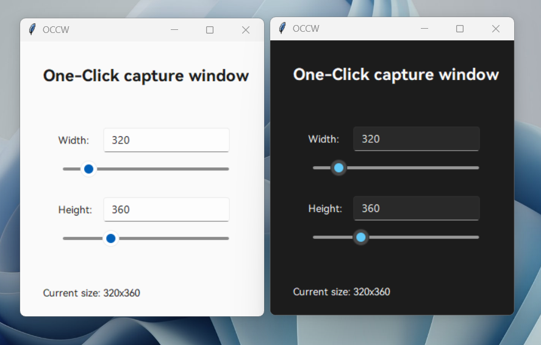

# One-click-capture-window

A boring project for quickly getting the window size you want while screen recording.😀

You can enter a value or drag the slider to quickly change the window size.

## Theme

This program allows you to modify specific code snippets to change the theme.

```python
        sv_ttk.set_theme("light")  # Light theme
    	sv_ttk.set_theme("dark")  # dark theme
```

**Themes**



## How to use

Clone this repo.

Open the terminal and run the py file.
